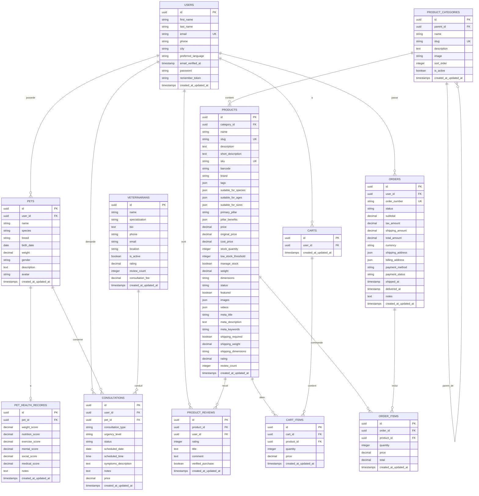

## 🗄️ **Modèle Conceptuel de Données (MCD)**



---

## 🏗️ **Diagramme UML de Classes**

```mermaid
classDiagram
    class User {
        +UUID id
        +String firstName
        +String lastName
        +String email
        +String phone
        +String city
        +String preferredLanguage
        +DateTime emailVerifiedAt
        +String password
        +pets() Collection
        +consultations() Collection
        +reviews() Collection
        +cart() Cart
        +orders() Collection
    }

    class Pet {
        +UUID id
        +UUID userId
        +String name
        +String species
        +String breed
        +Date birthDate
        +Decimal weight
        +String gender
        +String description
        +String avatar
        +user() User
        +healthRecord() PetHealthRecord
        +consultations() Collection
        +getAge() Integer
        +getHealthScore() Decimal
    }

    class PetHealthRecord {
        +UUID id
        +UUID petId
        +Decimal weightScore
        +Decimal nutritionScore
        +Decimal exerciseScore
        +Decimal mentalScore
        +Decimal socialScore
        +Decimal medicalScore
        +String notes
        +pet() Pet
        +getOverallScore() Decimal
        +getScoresArray() Array
    }

    class Consultation {
        +UUID id
        +UUID userId
        +UUID petId
        +String consultationType
        +String urgencyLevel
        +String status
        +Date scheduledDate
        +Time scheduledTime
        +String symptomsDescription
        +String notes
        +Decimal price
        +user() User
        +pet() Pet
        +veterinarian() Veterinarian
    }

    class Veterinarian {
        +UUID id
        +String name
        +String specialization
        +String bio
        +String phone
        +String email
        +String location
        +Boolean isActive
        +Decimal rating
        +Integer reviewCount
        +Decimal consultationFee
        +consultations() Collection
    }

    class Product {
        +UUID id
        +UUID categoryId
        +String name
        +String slug
        +String description
        +String sku
        +String brand
        +Array suitableForSpecies
        +String primaryPillar
        +Decimal price
        +Decimal originalPrice
        +Integer stockQuantity
        +Boolean featured
        +Array images
        +Decimal rating
        +category() ProductCategory
        +reviews() Collection
        +cartItems() Collection
        +orderItems() Collection
        +isInStock() Boolean
        +hasDiscount() Boolean
        +getImageUrl() String
    }

    class ProductCategory {
        +UUID id
        +UUID parentId
        +String name
        +String slug
        +String description
        +String image
        +Integer sortOrder
        +Boolean isActive
        +parent() ProductCategory
        +children() Collection
        +products() Collection
    }

    class ProductReview {
        +UUID id
        +UUID productId
        +UUID userId
        +Integer rating
        +String title
        +String comment
        +Boolean verifiedPurchase
        +product() Product
        +user() User
    }

    class Cart {
        +UUID id
        +UUID userId
        +user() User
        +items() Collection
        +getTotal() Decimal
        +getItemCount() Integer
        +addItem() Void
        +removeItem() Void
        +clear() Void
    }

    class CartItem {
        +UUID id
        +UUID cartId
        +UUID productId
        +Integer quantity
        +Decimal price
        +cart() Cart
        +product() Product
        +getTotal() Decimal
    }

    class Order {
        +UUID id
        +UUID userId
        +String orderNumber
        +String status
        +Decimal subtotal
        +Decimal totalAmount
        +JSON shippingAddress
        +String paymentStatus
        +DateTime shippedAt
        +user() User
        +items() Collection
        +getTotalItems() Integer
        +markAsShipped() Void
        +markAsDelivered() Void
    }

    class OrderItem {
        +UUID id
        +UUID orderId
        +UUID productId
        +Integer quantity
        +Decimal price
        +Decimal total
        +order() Order
        +product() Product
    }

    User ||--o{ Pet : owns
    User ||--o{ Consultation : requests
    User ||--o{ ProductReview : writes
    User ||--|| Cart : has
    User ||--o{ Order : places

    Pet ||--|| PetHealthRecord : has
    Pet ||--o{ Consultation : involves

    ProductCategory ||--o{ ProductCategory : parentOf
    ProductCategory ||--o{ Product : contains

    Product ||--o{ ProductReview : receives
    Product ||--o{ CartItem : inCart
    Product ||--o{ OrderItem : ordered

    Cart ||--o{ CartItem : contains
    Order ||--o{ OrderItem : includes

    Veterinarian ||--o{ Consultation : conducts
```

---